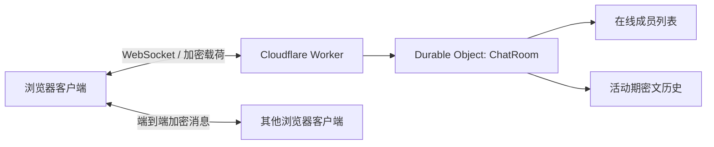

# NodeCrypt

NodeCrypt 是一个面向 Cloudflare Workers 部署的端到端加密临时群聊项目。它不需要账号系统，不保存聊天明文；服务端只负责 WebSocket 转发、房间成员协调，以及在房间仍有成员在线时缓存一份加密后的临时文本历史。

> 当前仓库：[`deeeeeeeeap/nodecrypt`](https://github.com/deeeeeeeeap/nodecrypt)

## 一键部署到 Cloudflare Workers

点击下面按钮，会基于本仓库创建 Cloudflare Workers 项目：

[](https://deploy.workers.cloudflare.com/?url=https://github.com/deeeeeeeeap/nodecrypt)

Cloudflare 会读取本仓库的配置：

- Worker 入口：`worker/index.js`
- 静态资源目录：`dist`
- 构建命令：`npm run build`
- 部署命令：`npm run deploy`
- Durable Object：`ChatRoom`

说明：

- 一键部署适合快速创建一个独立 Worker。
- 如果你希望后续持续跟随本仓库更新，建议先 Fork 本仓库，再在 Cloudflare 中连接自己的 Fork。
- 部署后建议绑定自定义域名并使用 HTTPS。本项目 Worker 侧已经处理 HTTP 到 HTTPS 的跳转。

## 功能特性

- **端到端加密聊天**：聊天内容在客户端加密和解密，服务端不保存明文。
- **Cloudflare Workers 原生部署**：使用 Worker + Durable Object 承载 WebSocket 房间。
- **临时群聊历史**：新加入同一节点的人可以看到当前活动期内的历史文本消息；房间无人后历史清空。
- **节点名 + 密码隔离**：同一个节点名配不同密码，会进入相互隔离的房间。
- **无需注册账号**：输入用户名、节点名和可选密码即可进入。
- **私聊、图片、文件、表情**：支持基础聊天增强能力。
- **移动端适配**：已针对手机登录页、聊天页、抽屉侧边栏做适配。
- **静态资源缓存优化**：构建产物使用 hash 文件名，Worker 对 assets 设置长期缓存。

## 临时历史的边界

NodeCrypt 的历史消息不是永久数据库。

- 只缓存公共文本消息。
- 图片、文件、私聊不会进入临时历史。
- 历史内容在客户端使用房间名和密码派生的密钥加密，Worker 只缓存密文。
- 新成员必须使用完全相同的节点名和密码，才能解密当前活动期历史。
- 当房间所有成员离开后，Durable Object 内存中的临时历史会清空。

这个设计适合临时协作、短会话群聊、一次性分享，不适合作为长期消息归档工具。

## 架构概览



主要模块：

- `client/`：前端页面、聊天 UI、加密逻辑、文件和图片处理。
- `worker/`：Cloudflare Worker 入口与 Durable Object 房间逻辑。
- `scripts/cloudflare-smoke.mjs`：本地 Worker smoke 测试。
- `wrangler.toml`：Cloudflare Workers、Assets、Durable Object 配置。

## 加密与房间隔离

当前实现包含三层关键保护：

1. **Worker 房间隔离**
   - 客户端会基于节点名和密码生成房间 scope。
   - Worker 根据 room hash 路由到对应 Durable Object。
   - 同节点名、不同密码会进入不同房间。

2. **服务端身份校验**
   - 每个 Durable Object 房间持久保存 RSA 身份密钥。
   - 客户端使用 TOFU 方式固定服务端身份，降低中间人替换风险。

3. **客户端内容加密**
   - 客户端之间使用 ECDH 派生共享密钥。
   - 实际聊天内容使用客户端侧密钥加密。
   - 服务端只看到加密载荷。

## 本地开发

环境要求：

- Node.js >= 22
- npm
- Cloudflare Wrangler
- Chrome / Edge，或为 `npm run smoke:cloudflare` 设置 `CHROME_PATH`

安装依赖：

```bash
npm install
```

启动本地 Worker：

```bash
npm run dev
```

构建前端：

```bash
npm run build
```

部署到 Cloudflare：

```bash
npm run deploy
```

## 部署前检查

常用检查命令：

```bash
npm run build
npx wrangler deploy --dry-run
npm run smoke:cloudflare
```

说明：

- `npm run build`：生成 `dist` 静态资源。
- `npx wrangler deploy --dry-run`：检查 Worker、Assets、Durable Object 配置是否能被 Wrangler 正确打包。
- `npm run smoke:cloudflare`：本地启动 `wrangler dev`，自动验证 WebSocket、群聊、临时历史、错误密码隔离、房间无人后历史清空等关键路径。

如果只是改 README 或纯样式小修，不一定需要跑完整 smoke。

## Cloudflare 配置要点

`wrangler.toml` 已包含当前部署所需配置：

```toml
name = "nodecrypt"
main = "worker/index.js"
compatibility_date = "2026-05-15"
compatibility_flags = ["nodejs_compat"]

[assets]
directory = "./dist"
not_found_handling = "single-page-application"
run_worker_first = true
binding = "ASSETS"

[durable_objects]
bindings = [
  { name = "CHAT_ROOM", class_name = "ChatRoom" }
]

[[migrations]]
tag = "v1"
new_sqlite_classes = ["ChatRoom"]
```

首次部署 Durable Object 时，Cloudflare 会根据 migrations 创建对应类。后续如果修改 Durable Object 类名或新增类，需要同步更新 migrations。

## 使用建议

- 节点名和密码需要完整一致，成员才能进入同一个房间。
- 需要一定安全性的房间应设置较强密码。
- 不要把节点名和密码发到公开渠道。
- 不要把 NodeCrypt 当作永久消息存储使用。
- 推荐使用现代浏览器，并通过 HTTPS 访问。

## 常见问题

### 为什么新人能看到之前消息？

只要房间里仍有成员在线，Worker 会保留当前活动期的公共文本密文历史。新成员使用相同节点名和密码进入后，可以解密这些历史。

### 为什么所有人离开后历史没了？

这是设计目标。房间无人后，临时历史会被清空，避免变成长期消息库。

### 忘记密码还能恢复历史吗？

不能。密码参与房间隔离和历史解密。密码不同会进入另一个独立房间，也无法解密原房间历史。

### 可以不用 Cloudflare Workers 吗？

当前主线目标是 Cloudflare Workers 部署。仓库里保留了部分本地/服务端历史结构，但推荐生产部署使用 Worker + Durable Object。

## 开源协议

本项目使用 ISC License。

---

**NodeCrypt** - 临时、安全、无需账号的端到端加密节点群聊。
